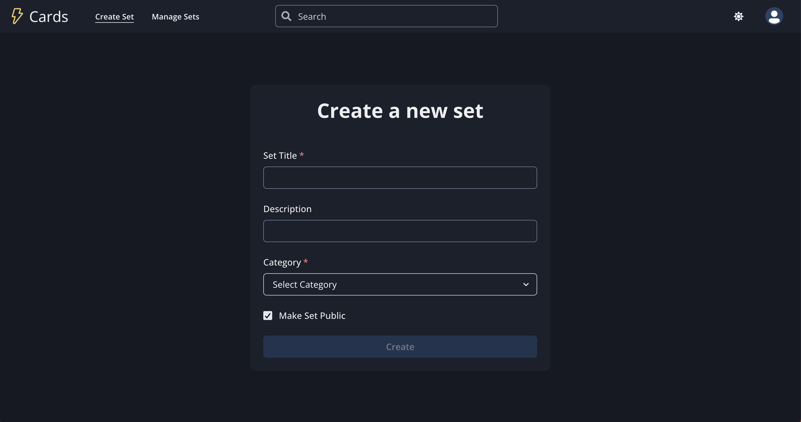

View server code [here](https://github.com/kblair40/flashcard-server)

---

## Overview

Create flashcard sets, optionally make them accessible to the community, and study them.

## Usage

1. Click Sign Up in upper-right corner or the large 'Create and Account For Free' button.  Fill out all fields and click "Sign Up".  The email address just needs to look like an email address.  You will not need to confirm it.

2. Initially, you won't have any sets.  If you would like to study a set created by another user, click "Study" in the menu of a set listed under "Latest Sets From the Community" on the right side of the home page (or bottom if on mobile).  Alternatively, you can search sets using the search input in the navbar.  Clicking on any set automatically starts a new study session with that set.  Searches are sent on every change event if there are at least 3 characters entered.

3. To create a set, click 'Create Set' in the navbar, or the large 'Create a Set' button on the homepage.  The latter will not be available once you've created a set, but the navbar option will always be there.
Give your set a title and select the category that best fits the subject material of the flashcard set.  Leave the 'Make set Public' checkbox checked to allow your set to be searchable/studyable by other users.  Just uncheck it if you only want the set to be usable by your account.

4. The upper editor modifies the front of the card and lower editor modifies the back of the card.  The 'Save Card' and 'New Card' buttons are only enabled when there is content on both sides of the card.  The editor toolbar buttons work the same way you'd expect them to in Microsoft Word, Google Docs, etc.
Saved cards will show up in the left hand side bar and a preview of the text content of the front side will be shown.  To edit the card, simply click on it.  With a card selected, you will also notice the option to delete the card is enabled.  When you are finished, click Exit, or just leave the page.  Your progress is saved as you create/edit/delete cards, so the set is already saved.  
**Note: You can set default styles for each card side by clicking "Settings" in the dropdown menu in the avatar menu.  If you always want the front content to be centered and bold, you can set that there.**

5. With a set created, you can start a study session from the home page by simply clicking the "Study" button next to one of your sets.  If you made your set public, you should see it in the "Latest Sets From The Community" section as well.

6. The front of the first card will be shown to start.  Flip a card by clicking the "Flip" button, and show the next/previous card with the "Last Card" and "Next Card" buttons.  You can randomize the cards order by clicking "Randomize" in the lower-right corner and hide the cards by clicking "Hide".  Click on a specific card to navigate directly to that card.
You may notice the timer above the Last/Next buttons.  Your study sessions durations are recorded and can be viewed/deleted in "Manage Sets".

#### Usage (Other)
 - The Sun/Moon Icon button in the upper-right will change the color theme from dark to light, or vice-versa if you're currently using light mode.
 - In Manage Sets, you can edit/delete your flashcard sets, as well as view/delete past study sessions.

